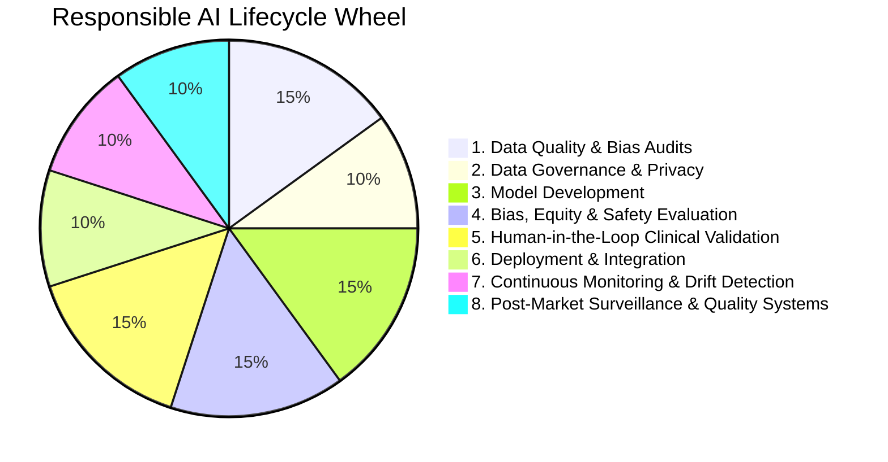

# responsible-healthcare-ai
Pallavi - Responsible AI in Healthcare framework &amp; demo starter

## Responsible AI Lifecycle Wheel (Inspired from my learnings at Mayo Clinic Platform)

```mermaid
pie title Responsible AI Lifecycle Wheel
    "1. Data Quality & Bias Audits" : 15
    "2. Data Governance & Privacy" : 10
    "3. Model Development" : 15
    "4. Bias, Equity & Safety Evaluation" : 15
    "5. Human-in-the-Loop Clinical Validation" : 15
    "6. Deployment & Integration" : 10
    "7. Continuous Monitoring & Drift Detection" : 10
    "8. Post-Market Surveillance & Quality Systems" : 10
```
